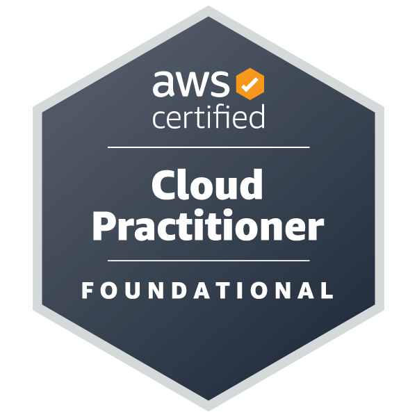
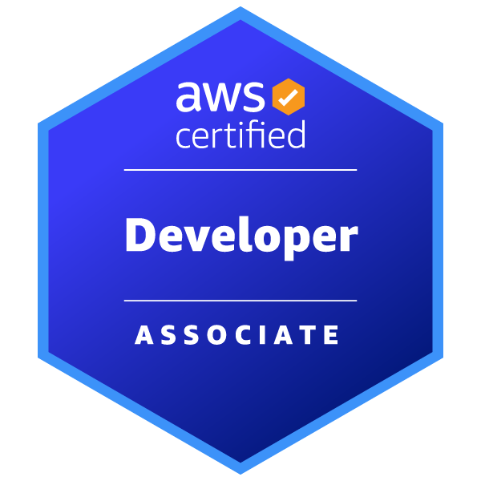
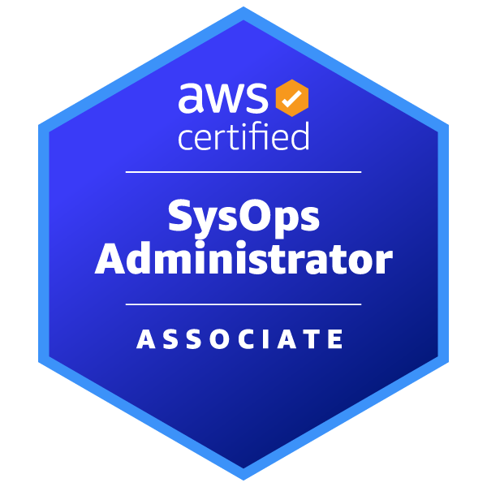
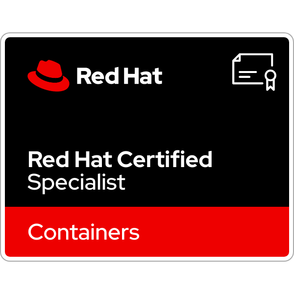
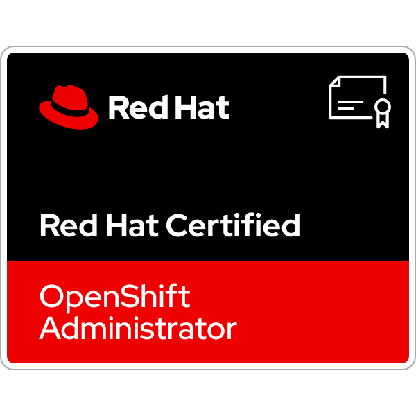
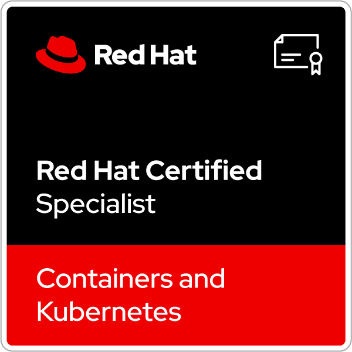
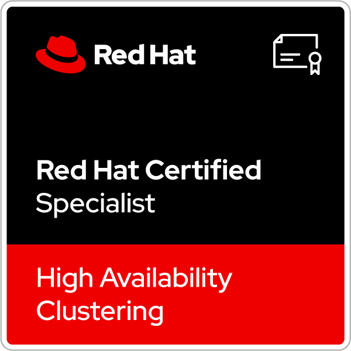

# Muzahedul Haque's Profile: 
#### IT & cloud computing professional with more than ten years of experience. Expert in platform planning & deployment, cloud computing, telecommunication signaling trace analysis, cybersecurity, etc.

- [CV](https://github.com/m-mishad/m-mishad/blob/f4f29de7e7e2ab3b3c3789acaeac5fc9e7fe4eba/CV_Md%20Muzahedul%20Haque.pdf)
- [Certification profile](https://www.credly.com/users/md-muzahedul-haque/badges)
- [LinkedIn profile](https://www.linkedin.com/in/mishad211/)

### Badges:

     

  

  

   

   

<h3 align="left">Technical Skills:</h3>

           

<h3 align="left">Connect with me:</h3>

<a href="https://stackoverflow.com/users/9861238/muzahedul-haque" target="blank">" height="30" width="40" /></a>
<a href="https://www.leetcode.com/<replace>" target="blank">" height="30" width="40" /></a>

